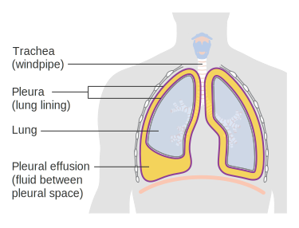
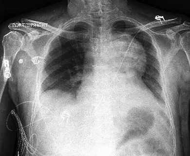
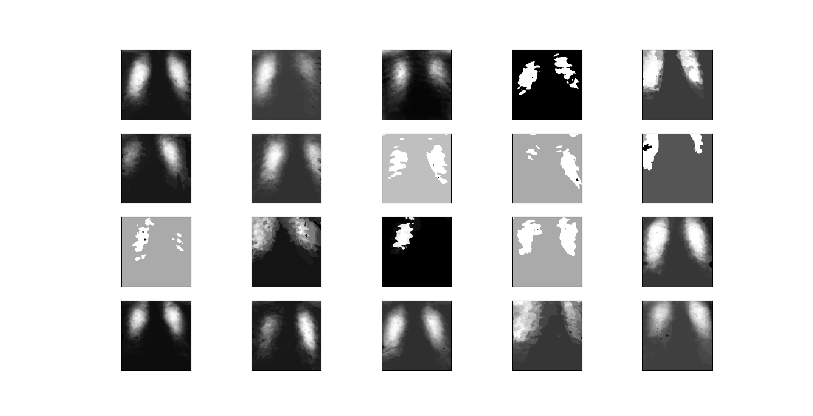
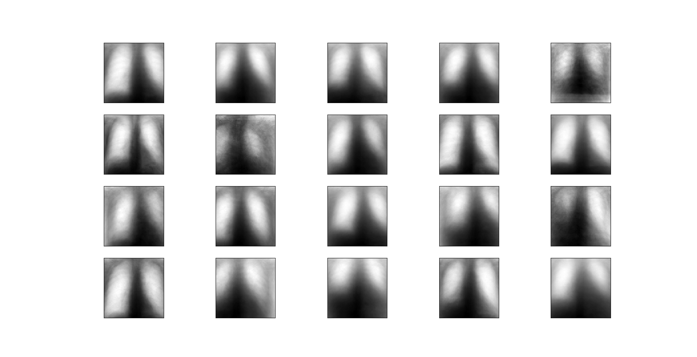
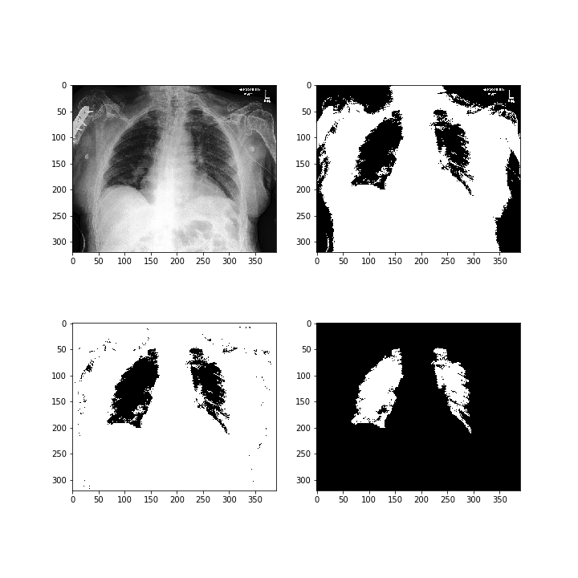
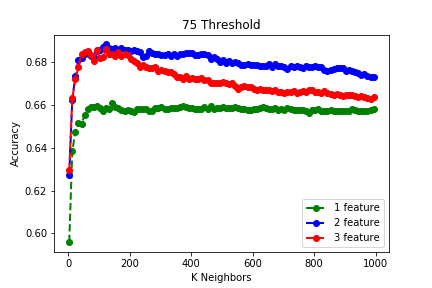
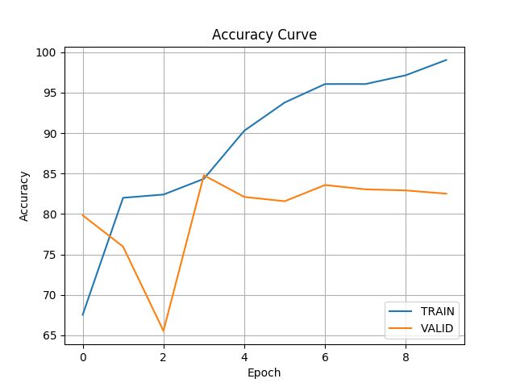
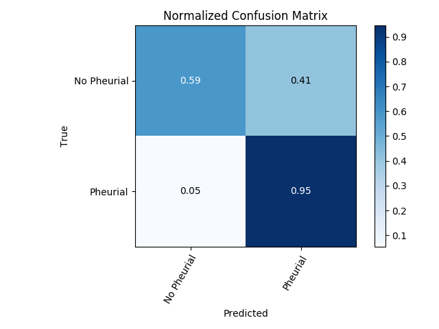

# Chest X-ray Classification

By Steven Hillerman, Leonardo Camacho A, Wyndham Hudson, and Thomas Kim</h2>

## Overview
This page documents our semester project for Georgia Tech's masters level Machine Learning course in the fall of 2019.  The goal of the project was to create a program capable of taking in X-ray images of a human chest and using those images to determine if the patient has a condition called Pleural Effusion.  According to <a href = "https://medlineplus.gov/ency/article/000086.htm">MedlinePlus.gov</a>, Pleural Effusion occurs when there is an excess amount of fluid built up in the layers of tissue surrounding the lung.  This condition can be visually identified in X-rays because the excess fluid builds up underneath one lung, causing it to be compressed vertically (see Figure 1).  Our goal in this project was to create a program that can identify Pleural Effusion automatically using an X-ray image.
          

Figure 1. Image Credit to Cancer Research UK

<h2>Data</h2>
            
Our data came from a Stanford project called CheXpert.  The CheXpert project provides a large dataset of labeled X-ray images.  More information on the CheXpert project can be found <a href = "https://stanfordmlgroup.github.io/competitions/chexpert/">here</a>.
            

            
While the dataset contained images of a variety of different medical conditions, we elected to focus on only one condition: Pleural Effusion.  We chose Pleural Effusion because there was a large number of positive cases of the condition in the dataset.  Focusing on only one condition allowed us to experiment with multiple methods of classification.  Below are example images for patients with and without Pleural Effusion.
            

            <h4>No Finding:</h4>
               
              Figure 2: Healthy Lung
            <h4>Pleural Effusion:</h4>
               
              Figure 3: Lung With a Pleural Effusion
            <h4>Data Details</h4>
              
The original dataset from CheXpert contained 223,414 images, each classified as either "No Finding" or one of several medical conditions. Because our focus was on Pleural Effusion, removed all data cases that were not either positive Pleural Effusion or positive No Finding.  This cut reduced the size of our dataset to 108,568 images.  Because Pleural Effusion can be best identified from the front, and to prevent the differences in perspective from dominating the feature set, we removed all instances of lateral images from the dataset, focusing only on images taken from the front.  This reduced out dataset to its final size of 93,873 images.  While the original dataset contained information about each patient's age and sex, we decided to focus exclusively on the image data and labels.

<h2>Strategy</h2>

Going into the project, we were not sure what learning algorithm would be best suited for our needs.  Because of this, we decided to try several different classification algorithms and work from those results.  We tried two unsupervised algorithms: K-Means and Gaussian Mixture Model (GMM).  Neither algorithm produced very good results.  We also tried two supervised learning algorithms and one semi-supervised learning algorithm.  The first supervised learning algorithm was Convolutional Neural Networks (CNN).  The second was K-Nearest Neighbors.  Our semi-supervised learning algorithm was a version of Label Propogation called Label Spreading.  Each attempt will be documented in more detail below.
            

  

  <h3>K-Means and Gaussian Mixture Model (GMM)</h3>
                
We used the sci-kit learn python packages for our implementation of K-Means and GMM.  To attempt to capture more complex data, we created 20 different clusters for each algorithm, with the intent that some clusters would be composed of mostly positive Pleural Effusion data while the rest of the clusters were mostly No Finding.  Even with 20 clusters and only the frontal images being considered, both K-Means and GMM struggled to produce any meaningful results.  Our conclusion is that unsupervised clustering is simply not powerful enough to assist in this project without significant data pre-processing to bring out the important features.
                

  
Below are the images we reconstructed for the 20 clusters we created, as well as some plots showing the distribution of data throughout the clusters.  As you can clearly see, these approaches produced nothing of interest.

                <h4>K-Means:</h4>
                   
                  Figure 4: K-Means Clustering
                   
                  Figure 5: K-Means Cluster Distributions
                <h4>GMM:</h4>
                   
                  Figure 6: GMM Clustering
                   
                  Figure 7: GMM Clustering Distributions

  <h3>K-Nearest Neighbors (KNN)</h3>
                <h4>Preprocessing</h4>
                  
 We used a pre-processing algorithm that takes the greyscale X-ray images and converts them to only two colors to identify areas that might be lungs. As can be seen in the image below, the lungs are significantly darker than the rest of the body, so the algorithm was able to successfully identify the lung areas to pass to our learning algorithm.  We removed any outliers to leave just the lungs in the final image. This process is shown in Figure 8.
                  

                   
                  Figure 8: KNN Preprocessing Process
                <h4>Implementation</h4>
                  
We used the sci-kit learn implementation of the K-Nearest Neighbors algorithm. The features were extracted based on the number of pixels making up the left lung, the number of pixels in the right lung, and the total number of pixels in the image. The inspiration behind using K-Nearest Neighbors was that there would be varying differences between the area of the right lung and the area of the left lung if the patient had a pleural effusion or if the patient was healthy. These differences would cluster together and K-Nearest Neighbors would be efficient at determining whether the X-ray showed features more similar to a healthy patient or a patient with a pleural effusion. The number of features and optimal number of neighbors was determined through experimentation, as shown in the image below.
                  

                   
                  Figure 9: Finding the Optimal Number of Neighbors
                <h4>Results</h4>
                  
The supervised KNN algorithm was a significant improvement over the unsupervised K-Means and GMM algorithms.  The maximum accuracy of the algorithm was found using 125 neighbors and two features (the ratio of left pixels to right pixels and the ratio of right pixels to total pixels). The accuracy was still relatively low, which may be due to inconsistancies in the preprocessing algorithm, as the algorithm worked very well for some X-ray images and not well at all for others. With only 68.8% accuracy, there is still plenty of room for improvement in subsequent algorithms.  The evaluation scores (calculated with sci-kit learn functions) are shown below.
                  

                <h4>KNN Evaluation</h4>
                  <ul>
                    <li>Accuracy Score: 0.68836</li>
                    <li>Precision Score: 0.67085</li>
                    <li>Recall Score: 0.72943</li>
                    <li>Jaccard Index: 0.53718</li>
                    <li>F1 Score (F-measure): 0.69891</li>
                  </ul>

<h3>Label Spreading</h3>
                <h4>Preprocessing</h4>
                  
In this attempt, we used a different method for preprocessing our data than we used for KNN.  For Label Spreading, we read in the test images with Matplotlib's pyplot imread function.  We did not do much other preprocessing other than flattening each image to a one-dimensional numpy array.  Each pixel was considered a feature.  We used 70% of the data for training and 30% of the data for testing.
                  

                <h4>Implementation</h4>
                  
Label Spreading is a true semi-supervised learning algorithm.  Label Spreading is a form of Label Propogation that uses a loss function and regularization to increase its capacity to handle noise.  We used the sci-kit learn implementation of the algorithm for the program.
                  

                <h4>Results</h4>
                  
Label spreading was a significant improvement over any of the previous algorithms that we had tried.  At 86.8%, it boasted a fairly strong accuracy score, with both its Recall and F1 scores breaking 90%.  The full breakdown of evaluation scores can be seen below.
                <h4>Label Spreading Evaluation</h4>
                  <ul>
                    <li>Accuracy Score: 0.86782</li>
                    <li>Precision Score: 0.88208</li>
                    <li>Recall Score: 0.96321</li>
                    <li>Jaccard Index: 0.85333</li>
                    <li>F1 Score (F-measure): 0.92086</li>
                  </ul>

 <h3>Convolutional Neural Network (CNN)</h3>
                <h4>Preprocessing</h4>
                  
Similar to the approach used in Label Spreading, we read the chest X-ray images using Matplotlib's pyplot imread function. After this, we resized the array generated by the imread function to ensure that every image would have the same number of features.  We turned these images into a 3-D  Numpy array to pass to the Neural Network.  Then, we split the data into two sets: 70% for training, and 30% for validation.  We also created an additional testing data set of approximately 30-40% the size of the training dataset to help choose the best model.  It is important to emphasize that because the team decided to use the PyTorch library for CNN, the data had to be converted from Numpy arrays into a Tensor data set.
                  

                <h4>Implementation</h4>
                  
For Convolutional Neural Network, as previously mentioned, the team decided to use PyTorch to build the structure of the model. This structure was composed of a combination of convolutional layers with their respective activation layers, such as ReLU and Max pooling, to then be passed to a linear regression layer to output the predictions. Using a batch-size of 32 for small data-sets and 50 for bigger data-sets, the algorithm chooses the best model using the training and validation datasets at each of the 10 epochs and tests it against the testing data.  The results can be seen below in Figure 10.
                  

                   
                  Figure 10: Accuracy After Each Epoch
                <h4>Results</h4>
                  
As can be seen in the results below, CNN scored quite well against our evaluation algorithms, although it was slightly outperformed by Label Spreading.  However, we were able to generate a confusion matrix for CNN (Figure 11), which helped to explain some of the potential problems our algorithm faced.  The data we used contained significantly more Pleural Effusion positives than it had No Findings.  This imbalance caused the CNN to create some false positives, which can be clearly seen in the confusion matrix below.
                   
                  Figure 11: CNN Confusion Matrix

  <h4>Convolutional Neural Network Evaluation</h4>
                <ul>
                  <li>Accuracy Score: 0.84600</li>
                  <li>Precision Score: 0.86131</li>
                  <li>Recall Score: 0.95886</li>
                  <li>Jaccard Index: 0.83062</li>
                  <li>F1 Score (F-measure): 0.90747</li>
                </ul>

  

  <h2>Conclusion</h2>
              
Overall, this project was a success, as both CNN and Label Spreading produced excellent results on the test data.  Through this project, we learned that it is often harder to prepare your data for machine learning than it is to actually perform the learning.  There are so many excellent algorithms freely available through libraries like sci-kit learn that the actual learning process is fairly simple to implement.  The challenging part can be getting the data from its original form into a form that can be read and understood by these algorithms.  While we could potentially have produced even better results with more advanced data pre-processing, we feel that we were able to successfully complete our goal of producing a solid algorithm for Pleural Effusion identification in X-Ray images. We believe that the next step to improving our prediction models would be to focused on better preprocessing of the data using methods such as a lung identification algorithm and heatmaps.
              

 <h2>Individual Responsibilities</h2>
              <ul>
                <li>Thomas Kim: Unsupervised learning algorithms.</li>
                <li>Wyndham Hudson: K-Nearest Neighbors algorithm.</li>
                <li>Steven Hillerman: Label Spreading algorithm and webpage editing</li>
                <li>Leo Camacho: CNN algorithm</li>
              </ul>

<h2>References</h2>
              <ul>
                <li>Liu, Han, et al. "SDFN: Segmentation-based Deep Fusion Network for Thoracic Disease Classification in Chest X-ray Images." Computerized Medical Imaging and Graphics (2019).</li>
                <li>"Pleural Effusion: MedlinePlus Medical Encyclopedia." MedlinePlus, U.S. National Library of Medicine, medlineplus.gov/ency/article/000086.htm.</li>
                <li>Rajpurkar, Pranav, et al. "Chexnet: Radiologist-level pneumonia detection on chest x-rays with deep learning." arXiv preprint arXiv:1711.05225 (2017).</li>
                <li>Rajpurkar, Pranav, et al. "Deep learning for chest radiograph diagnosis: A retrospective comparison of the CheXNeXt algorithm to practicing radiologists." PLoS medicine 15.11 (2018): e1002686.</li>
                <li>Roth, Holger R., et al. "Deeporgan: Multi-level deep convolutional networks for automated pancreas segmentation." International conference on medical image computing and computer-assisted intervention. Springer, Cham, 2015.</li>
                <li>Wang, Xiaosong, et al. "Chestx-ray8: Hospital-scale chest x-ray database and benchmarks on weakly-supervised classification and localization of common thorax diseases." Proceedings of the IEEE conference on computer vision and pattern recognition. 2017.</li>
                <li>Yin, Wenpeng, et al. "Abcnn: Attention-based convolutional neural network for modeling sentence pairs." Transactions of the Association for Computational Linguistics 4 (2016): 259-272.</li>
              </ul>

  

  </section>
    

To run the CNN model, go inside cnn_model and run python train_CNN.py
If you want to change some of the parameters, change the following as follow:

I recommend for these two to be 10 Epochs, and 32 Batch size, but feel free to change them.
train.py: NUM_EPOCHS (line 33),
			BATCH_SIZE (line 34)

In mymodels.py you could change the structure of the CNN.

In mydatasets.py, the images are being gathered as np arrays. 
Change the amount of training + valid: max_img (line 30), testing: size_test (line 60)

IMPORTANT!
plots.py: Losses (line 21), Accuracies (line 31), Confusion Matrix (line 68)
			
			

  </body>
